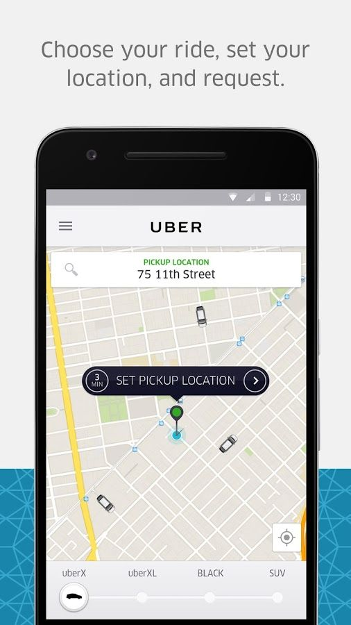

##Comparative Research
 

On the topic of sexual assault and violence towards women, I'd like to bring forward the idea of having a crowd-shared buddy system. It wouldn't cost anything; rather, it would be a safety system for women who are headed out for the night and would like someone to join. 

Uber and Airbnb are some of the current top leaders in the crowd-sharing industry: Uber for ride sharing, and Airbnb for home sharing. The few key elements that they employ are the extensive measures that they take to ensure that both sides are happy with the transaction. This includes measures such as cross-reviewing, government ID verification, and generally a good vibe throughout the entire process. 

Taking a look first at Uber's interface design, we see clearly that there are drivers who are nearby, and it's almost comforting to know that service will be quick. Interaction within the app is smooth and intuitive -- big buttons denote the most necessary actions such as requesting a ride, and more options are available to the user as necessary. Since it's based on current distance, the map is a nice place to land after loading the app. 

Airbnb, while geared towards a longer-range plan, still has a nice interface. Its clean colors and big filter numbers allow the user to search for housing in the way that they want. In an advantage over Uber, Airbnb shows off a host's rating first and foremost. By doing so, the viewer is further comforted that they will not be staying with someone who is hostile and dangerous. 